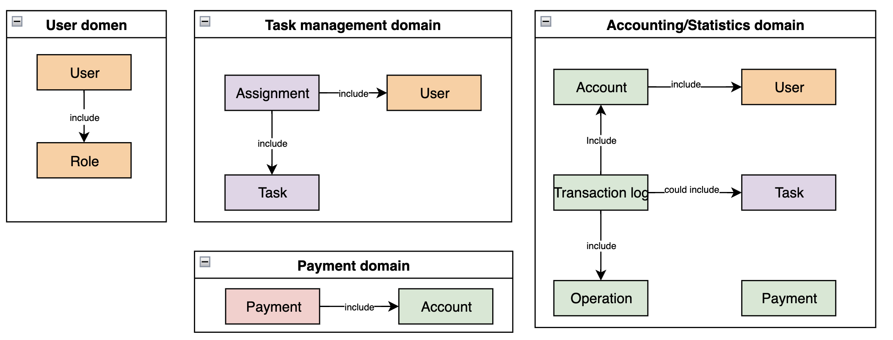
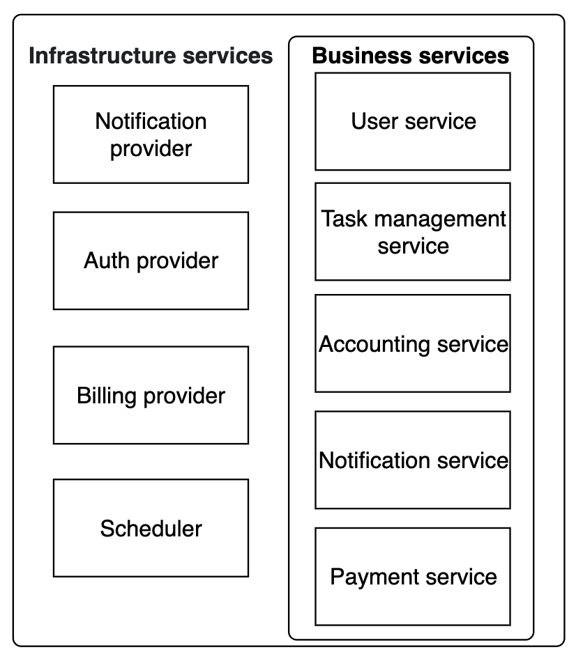
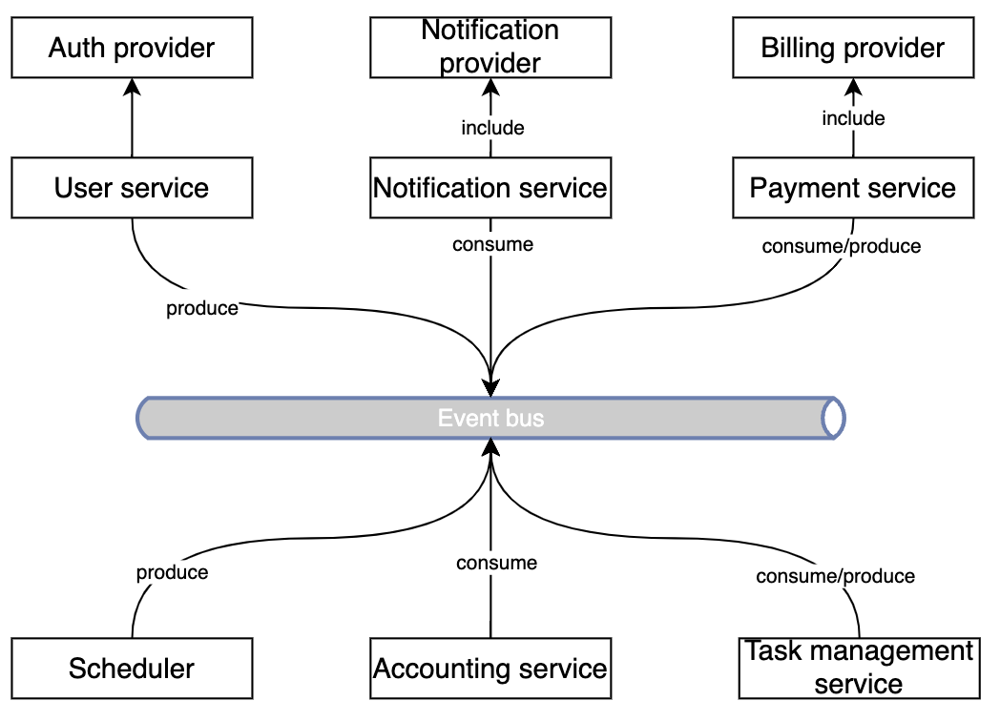

# Popug task tracker

### Data model and Domains:

### Services and infrastructure:

### Communication:

### Business cases
#### User registration in task tracker:
1) Create user account & generate login/password
2) Create payment account for created user
3) Send notification to user (user has been added to task tracker)

**events:**

| Name        | Data                                                          | Producer     | Consumers                                                     |                                             
|:------------|:--------------------------------------------------------------|:-------------|:--------------------------------------------------------------|
| UserCreated | userPublicId, temporary credentionals && notificationSettings | Auth Service | TaskManagementService, AccountingService, NotificationService |

#### Create and assign new task to user steps:
1) Create new task (calculate task cost) and assign to random user
3) Create new transaction: change user account balance (decrease, reason: task assigment)
4) Update account balance
5) Send notification to user (new task has been assigned & account balance has been decreased)

**events**

| Name                  | Data            | Producer              | Consumers                              |                                             
|:----------------------|:----------------|:----------------------|:---------------------------------------|
| TaskCreated           | taskInfo        | TaskManagementService | AccountingService, NotificationService |
| AccountBalanceUpdated | transactionInfo | AccountingService     | AccountingService                      |

#### Task completion:
1) Update task status
2) Create new transaction: change user account balance (increase, reason: task completion)
3) Update account balance
4) Send notification to user (account balance has been increased)

**events**

| Name                  | Data              | Producer              | Consumers                              |                                             
|:----------------------|:------------------|:----------------------|:---------------------------------------|
| TaskStatusChanged     | taskId, newStatus | TaskManagementService | AccountingService, NotificationService |
| AccountBalanceUpdated | transactionInfo   | AccountingService     | AccountingService                      |

#### Shuffle tasks steps:
1) Initiate shuffle process 
2) Task reassign & update tasks
3) Create new transaction: change user account balance (decrease)
4) Update account balance
5) Send notification to user (new task has been assigned)

| Name                  | Data                           | Producer                | Consumers                              |                                             
|:----------------------|:-------------------------------|:------------------------|:---------------------------------------|
| TaskReassigned        | taskInfo, assignFrom, assignTo | Task management service | AccountingService, NotificationService |
| AccountBalanceUpdated | transactionInfo                | AccountingService       | AccountingService                      |

#### Payments steps:
1) Initiate payment process task
2) Find users with positive balance 
3) Create new transaction: change user account balance (zeroing, reason: payment)
4) Update account balance
5) Initiate & sent payment
6) Payment confirmation
7) Send notification to user (payment has been sent)

| Name                     | Data            | Producer          | Consumers                           |                                             
|:-------------------------|:----------------|:------------------|:------------------------------------|
| MakeDailyPaymentsCommand | date: today()   | SchedulerService  | AccountingService                   |
| AccountBalanceUpdated    | transactionInfo | AccountingService | AccountingService                   |
| SentPaymentCommand       | paymentCommand  | AccountingService | PaymentService                      |
| PaymentSendingConfirmed  | paymentInfo     | PaymentService    | AccountService, NotificationService |
